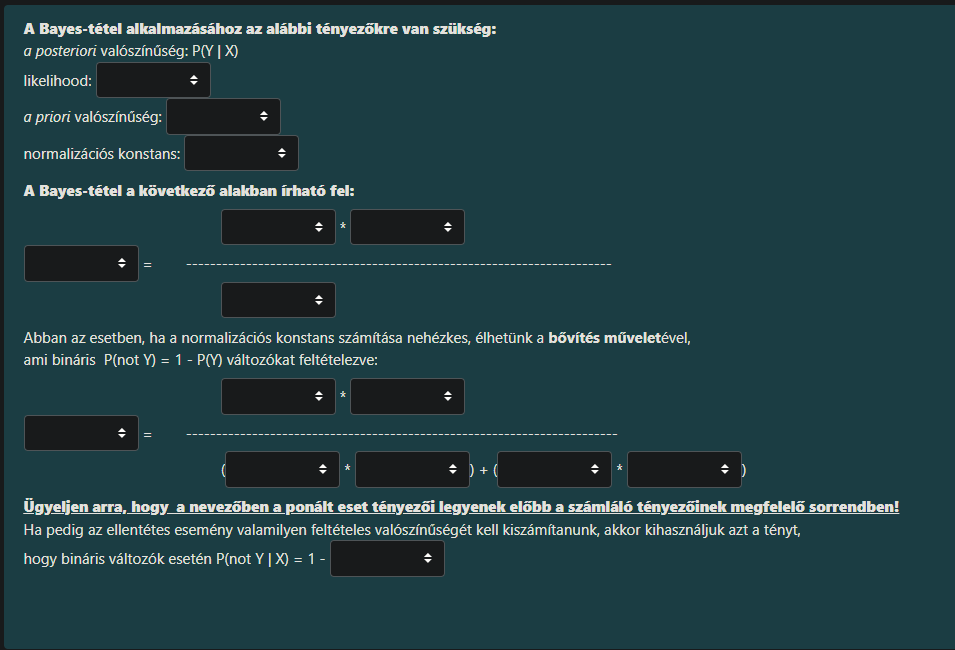
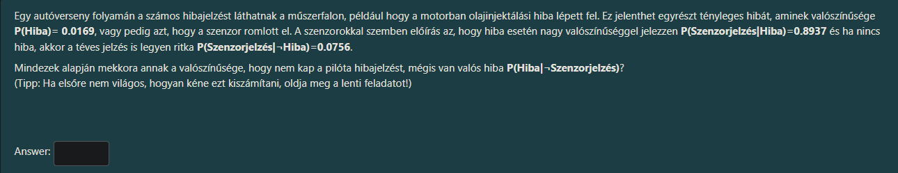

Ez a feladat a **Bayes-tétel** "csontváza". A mesterséges intelligenciában és a valószínűségszámításban ez a legfontosabb képlet, amikor bizonytalan tudás alapján akarunk következtetni (pl. orvosi diagnózis: pozitív a teszt, de mennyi az esélye, hogy tényleg beteg vagyok?).

A jelölések általában:
*   **Y**: A Hipotézis (pl. "Beteg vagyok")
*   **X**: A Megfigyelés/Bizonyíték (pl. "Pozitív a teszt")
*   **not Y**: A Hipotézis ellentettje (pl. "Nem vagyok beteg")

Íme a helyes kitöltés sorról sorra, fentről lefelé haladva:

### 1. Definíciók (Felső blokk)

Itt a fogalmakat párosítjuk a matematikai jelöléssel.

*   **likelihood:** **P(X | Y)**
    *(Magyarázat: Ez a feltételes valószínűség azt mutatja meg, mennyire valószínű a megfigyelés (X), ha a hipotézisünk (Y) igaz. Pl. Mennyire valószínű a pozitív teszt, ha beteg vagyok?)*
*   **a priori valószínűség:** **P(Y)**
    *(Magyarázat: Ez az előzetes tudásunk a hipotézisről, mielőtt bármit láttunk volna. Pl. A lakosság hány százaléka beteg alapból?)*
*   **normalizációs konstans:** **P(X)**
    *(Magyarázat: Ez a megfigyelés teljes valószínűsége, függetlenül attól, hogy mi az oka. Ez kerül a nevezőbe, hogy a végén 0 és 1 közötti számot kapjunk.)*

---

### 2. A Bayes-tétel alapképlete (Középső blokk)

Itt összeállítjuk a képletet: $\text{Posterior} = \frac{\text{Likelihood} \cdot \text{Prior}}{\text{Evidence}}$

*   Bal oldali doboz (az egyenlőségjel előtt): **P(Y | X)**
*   Számláló (felső rész): **P(X | Y)** `*` **P(Y)**
*   Nevező (alsó rész): **P(X)**

---

### 3. Bővített alak (Alsó nagy blokk)

Ez a legtrükkösebb rész! Itt a nevezőt ($P(X)$) fejtjük ki a **teljes valószínűség tétele** alapján. Azt mondjuk, hogy a megfigyelés ($X$) kétféleképpen jöhetett létre: vagy úgy, hogy $Y$ igaz, vagy úgy, hogy $Y$ hamis (not Y).

A feladat kéri: *"Ügyeljen arra, hogy a nevezőben a ponált [pozitív] eset tényezői legyenek előbb"*

*   Bal oldali doboz: **P(Y | X)**
*   Számláló (felső rész): **P(X | Y)** `*` **P(Y)**
*   Nevező (alsó rész) - Első zárójel (Ponált eset): (**P(X | Y)** `*` **P(Y)**)
*   Nevező (alsó rész) - Második zárójel (Negált eset): (**P(X | not Y)** `*` **P(not Y)**)

---

### 4. Az utolsó sor (Kiegészítő valószínűség)

*   `P(not Y | X) = 1 -` **P(Y | X)**
    *(Magyarázat: Mivel vagy Y vagy nem Y történik, a két valószínűség összege 1. Ha tudjuk az egyiket, a másikat kivonással megkapjuk.)*

---

### Összefoglaló "puska" a legördülő menükhöz:

1.  sor: **P(X | Y)** | **P(Y)** | **P(X)**
2.  sor: **P(Y | X)** = (**P(X | Y)** * **P(Y)**) / **P(X)**
3.  sor: **P(Y | X)** = (**P(X | Y)** * **P(Y)**) / [ (**P(X | Y)** * **P(Y)**) + (**P(X | not Y)** * **P(not Y)**) ]
4.  sor: **P(Y | X)**

# újra mert felét nem mondta el

Örömmel! Ez a téma az egyik legizgalmasabb, mert lényegében arról szól, **hogyan gondolkodik egy detektív vagy egy orvos.**

A Bayes-tétel arra való, hogy **megfordítsuk a valószínűségeket.**

### Miért kell megfordítani? (Az alap probléma)

A világban általában az **Ok $\to$ Okozat** irányt ismerjük.
*   *Példa:* Ha valaki influenzás (Ok), akkor 90% eséllyel lázas (Okozat).
*   Ezt könnyű mérni statisztikákkal.

De a való életben fordítva látjuk a dolgokat: látjuk az **Okozatot** (lázas a beteg), és ki akarjuk találni az **Okot** (influenzás-e?).
*   *Kérdés:* Ha valaki lázas, hány százalék, hogy influenzás? (Nem 90%, mert ezer mástól is lehet lázas!).

Erre való a Bayes-tétel: **Kiszámolja az Ok valószínűségét az Okozat ismeretében.**

---

### A Képlet Részletei (A 4 főszereplő)

A képlet így néz ki általánosan:
$$P(Y | X) = \frac{P(X | Y) \cdot P(Y)}{P(X)}$$

Nézzük meg, ki kicsoda a te feladatodban (és az életben):

#### 1. Y (A Hipotézis / Az Ok)
Ez az, amire kíváncsiak vagyunk.
*   *Jelölés:* **a posteriori valószínűség ($P(Y|X)$)** – "Utólagos" valószínűség.
*   *Jelentése:* Mennyi az esélye a Hipotézisnek (Y), miután láttuk a Bizonyítékot (X)?
*   *Példa:* Mennyi az esélye, hogy **beteg vagyok (Y)**, feltéve, hogy **pozitív a teszt (X)**?

#### 2. P(Y) (A Priori / Előzetes tudás)
Ez az, amit a bizonyítékok nélkül tudunk a világról.
*   *Jelölés:* **a priori valószínűség ($P(Y)$)**.
*   *Jelentése:* Milyen gyakori ez a dolog általában?
*   *Példa:* Milyen gyakori ez a betegség a lakosság körében? Ha nagyon ritka (pl. 0.001%), akkor hiába pozitív a teszt, még mindig kicsi az esélye, hogy elkaptad. Ezt sokan elfelejtik, pedig kulcsfontosságú!

#### 3. P(X | Y) (Likelihood / Valószínűség)
Ez a teszt megbízhatósága.
*   *Jelölés:* **likelihood ($P(X|Y)$)**.
*   *Jelentése:* Ha a Hipotézis IGAZ (tényleg beteg vagy), mekkora eséllyel lesz IGAZ a Bizonyíték (pozitív a teszt)?
*   *Példa:* Az influenzások 90%-a lázas. Ez egy statisztikai tény.

#### 4. P(X) (Normalizációs konstans / A Bizonyíték gyakorisága)
Ez a nevező. Ez "normálja" a törtet, hogy a végeredmény 0 és 1 közé essen.
*   *Jelölés:* **normalizációs konstans ($P(X)$)**.
*   *Jelentése:* Mennyire gyakori a Bizonyíték (pl. a láz vagy a pozitív teszt) a világban, függetlenül attól, hogy mi okozza? (Lázasok az influenzások is, meg a gyulladásos betegek is, meg a napszúrásosok is...).

---

### A "Bővítés művelete" (A nevező kifejtése)

A feladat alsó része a legijesztőbb, pedig nagyon logikus.
A probléma: A valóságban szinte sosem tudjuk közvetlenül a $P(X)$-et (hogy az emberek hány százaléka produkál pozitív tesztet csak úgy).
Ezért **szétbontjuk az eseteket**.

A bizonyíték (X) kétféle embercsoporttól jöhet:
1.  Akiknél **IGAZ** a hipotézis (Y) $\rightarrow$ Ők a **"Valódi pozitívok"**.
2.  Akiknél **HAMIS** a hipotézis (not Y) $\rightarrow$ Ők a **"Álpozitívok"**.

A nevező tehát két részből áll össze (összeadjuk őket):
$$P(X) = \underbrace{P(X | Y) \cdot P(Y)}_{\text{Tényleg beteg és pozitív}} + \underbrace{P(X | \neg Y) \cdot P(\neg Y)}_{\text{Nem beteg, de mégis pozitív}}$$

*   **Első zárójel:** A Likelihood szorozva a betegség gyakoriságával.
*   **Második zárójel:** A teszt "hibaszázaléka" (téves riasztás) szorozva az egészségesek arányával.

Ezért volt a feladatban az a hosszú, összeadásos sor a nevezőben.

### Összefoglalva a feladat megoldását, általánosítva:

1.  A **számlálóba** (felülre) mindig a "JÓ" esetet rakjuk: amikor az Ok (Y) tényleg fennáll. ($Likelihood \cdot Prior$).
2.  A **nevezőbe** (alulra) az "ÖSSZES" esetet rakjuk: a JÓ eset + a ROSSZ eset (téves riasztás).
3.  A végeredmény megmondja, hogy a **JÓ eset mekkora szelete az ÖSSZES esetnek.**

Ez a Bayes-tétel lényege: kiszűri a zajt (téves riasztásokat) az előzetes tudásunk segítségével.

Ez egy kiváló, gyakorlati feladat a **Bayes-tétel** alkalmazására. Itt most nem a "pozitív tesztet" vizsgáljuk, hanem a "negatív tesztet" (amikor nincs jelzés), de a logika teljesen ugyanaz, csak a számokat kell megfordítanunk (komplementerét venni).

A kérdés: **Mennyi a valószínűsége, hogy van hiba, ha NEM jelez a szenzor?**
Matematikai jelöléssel: $P(\text{Hiba} \mid \neg\text{Szenzorjelzés})$

Haladjunk lépésről lépésre!

### 1. Gyűjtsük ki az adatokat

Először írjuk ki, mit tudunk, és számoljuk ki ezeknek az "ellentettjét" (komplementerét), mert azokra lesz szükségünk.

**Alapadatok (amiket megadtak):**
*   **$P(\text{Hiba}) = 0,0169$** (Ennyi az esélye, hogy baj van).
    *   $\Rightarrow$ Ebből következik: $P(\text{Nincs Hiba}) = 1 - 0,0169 = \mathbf{0,9831}$.
*   **$P(\text{Jelzés} \mid \text{Hiba}) = 0,8937$** (Jól működik a szenzor).
    *   $\Rightarrow$ Ebből következik, hogy a szenzor "tévedése" (nem jelez, pedig baj van):
        $P(\text{Nincs Jelzés} \mid \text{Hiba}) = 1 - 0,8937 = \mathbf{0,1063}$.
*   **$P(\text{Jelzés} \mid \text{Nincs Hiba}) = 0,0756$** (Téves riasztás).
    *   $\Rightarrow$ Ebből következik, hogy a szenzor "helyes hallgatása" (nem jelez, és nincs is baj):
        $P(\text{Nincs Jelzés} \mid \text{Nincs Hiba}) = 1 - 0,0756 = \mathbf{0,9244}$.

---

### 2. A Bayes-képlet felírása

Azt keressük, hogy $P(\text{Hiba} \mid \text{Nincs Jelzés})$.
A képletünk így néz ki:

$$ \frac{\text{Aki hibás ÉS nem jelez a szenzor}}{\text{Minden eset, amikor nem jelez a szenzor}} $$

Matematikailag:
$$ P(\text{Hiba} \mid \neg\text{Jelzés}) = \frac{P(\neg\text{Jelzés} \mid \text{Hiba}) \cdot P(\text{Hiba})}{P(\neg\text{Jelzés})} $$

---

### 3. Számolás

**A) A Számláló (A "rossz" eset, amit keresünk):**
Van hiba, de a szenzor nem szólt.
$$ 0,1063 \cdot 0,0169 = \mathbf{0,00179647} $$

**B) A Nevező (A teljes esélye annak, hogy a szenzor csendben van):**
Ez kétféleképpen történhethet:
1.  Van hiba, de nem szólt (ez a fenti szám): $0,00179647$
2.  Nincs hiba, és jogosan nem szólt: $0,9244 \cdot 0,9831 = 0,90877764$

$$ \text{Összesen} = 0,00179647 + 0,90877764 = \mathbf{0,91057411} $$

**C) A Végeredmény (Osztás):**
$$ \frac{0,00179647}{0,91057411} \approx 0,00197289... $$

---

### A Válasz:

Kerekítéstől függően (általában 4 tizedesjegyre kérik):
**0.0020** (vagy pontosabban **0.001973**)

**Answer:** `0.0020`

*(Tipp: Írd be a pontosabb értéket, ha a rendszer engedi, pl. 0.00197, de a 0.002 is jónak kell lennie).*