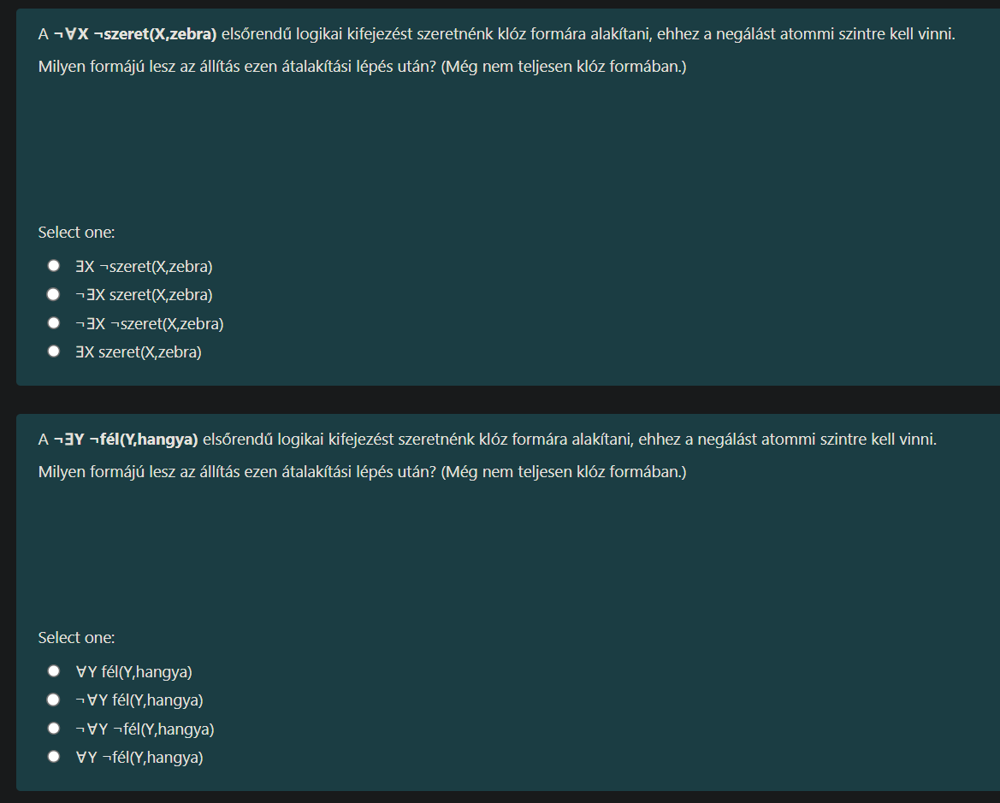

Ez az **Elsőrendű logika (First-Order Logic)** témakör, azon belül is a **kvantorok negálása**.

Itt egy nagyon egyszerű szabályt (De Morgan-szabály kvantorokra) kell alkalmazni, ami olyan, mint egy mérleg: ha a tagadást ($\neg$) beviszed a kvantor mögé, akkor a kvantor megfordul, és a belső rész is kap egy tagadást.

Nézzük a szabályokat és a megoldásokat:

---

### A Szabálykönyv (Puska)

1.  **A kvantor megfordul:**
    *   Ha $\neg \forall$ (Nem minden) volt $\rightarrow$ **$\exists$ (Létezik)** lesz belőle.
    *   Ha $\neg \exists$ (Nem létezik) volt $\rightarrow$ **$\forall$ (Minden)** lesz belőle.
2.  **A belső rész tagadódik:**
    *   Azt, ami a zárójelben van, szintén le kell tagadni.
    *   **Trükk:** Ha belül már volt egy negálás ($\neg$), akkor a **kettős tagadás** ($\neg \neg$) kioltja egymást, és eltűnik a "nem".

---

### 1. Kérdés: $\neg \forall X \neg \text{szeret}(X, \text{zebra})$

**Mit jelent ez magyarul?**
*"Nem igaz, hogy minden X nem szereti a zebrát."*

**Lépések:**
1.  A kinti $\neg$ bemegy.
2.  A $\forall$ megfordul $\rightarrow$ **$\exists$** lesz.
3.  A belső rész ($\neg \text{szeret}$) kap még egy negálást $\rightarrow$ $\neg \neg \text{szeret}$.
4.  Két "nem" = "igen". Tehát sima **szeret** marad.

**Eredmény:**
$\exists X \text{szeret}(X, \text{zebra})$
*(Magyarul: Van olyan X, aki szereti a zebrát.)*

**A helyes válasz:**
**Az utolsó: $\exists X \text{szeret}(X, \text{zebra})$**

---

### 2. Kérdés: $\neg \exists Y \neg \text{fél}(Y, \text{hangya})$

**Mit jelent ez magyarul?**
*"Nem igaz, hogy létezik olyan Y, aki nem fél a hangyától."*

**Lépések:**
1.  A kinti $\neg$ bemegy.
2.  A $\exists$ megfordul $\rightarrow$ **$\forall$** lesz.
3.  A belső rész ($\neg \text{fél}$) kap még egy negálást $\rightarrow$ $\neg \neg \text{fél}$.
4.  Két "nem" = "igen". Tehát sima **fél** marad.

**Eredmény:**
$\forall Y \text{fél}(Y, \text{hangya})$
*(Magyarul: Minden Y fél a hangyától.)*

**A helyes válasz:**
**Az első: $\forall Y \text{fél}(Y, \text{hangya})$**

---

### Összefoglalva a vizsgára:
Ha azt látod, hogy **$\neg \text{Kvantor} \neg \text{Állítás}$**, akkor a végeredmény mindig:
*   Kvantor megfordul.
*   Az összes negálás eltűnik.