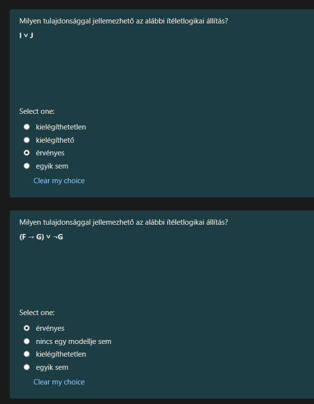
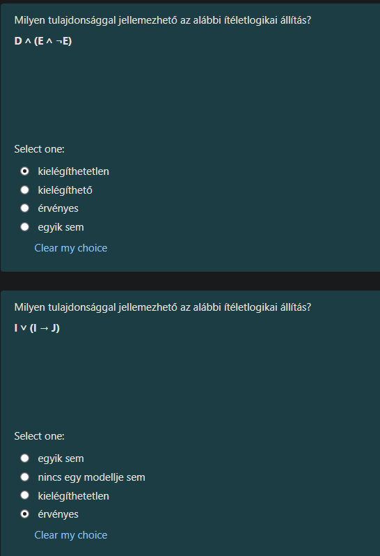
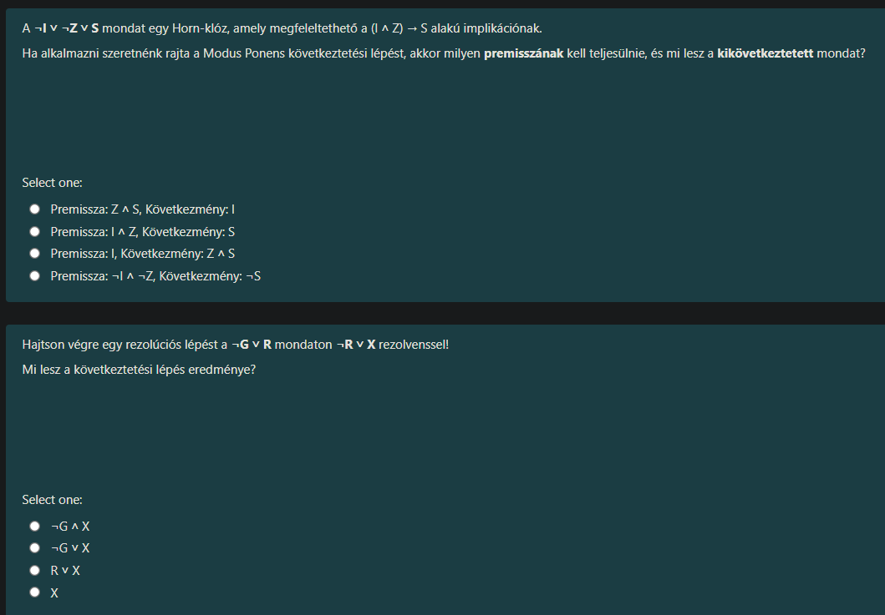

Át is eveztünk az MI következő nagy fejezetéhez: a **Logikához** (Tudásreprezentáció).

Ez a rész arról szól, hogyan tud a gép "gondolkodni" és következtetéseket levonni állításokból. Itt három alapfogalmat kell nagyon tisztán látni, ezekre kérdez rá mindkét feladat.

Mielőtt a konkrét megoldást megadom, tegyük tisztába a fogalmakat egy egyszerű "puskával":

1.  **Érvényes (Valid) / Tautológia:** Az állítás **MINDIG IGAZ**, bárhogy is állítod be a változókat (pl. "Esik vagy nem esik").
2.  **Kielégíthetetlen (Unsatisfiable) / Ellentmondás:** Az állítás **MINDIG HAMIS**, bárhogy próbálkozol (pl. "Esik és nem esik").
3.  **Kielégíthető (Satisfiable):** Az állítás **LEHET IGAZ**. Van legalább egy olyan eset, amikor igaz. (Vigyázz: Ami érvényes, az automatikusan kielégíthető is, de a tesztekben általában a "csak simán kielégíthető, de nem érvényes" esetre gondolnak ilyenkor).

---

### 1. Kérdés: $I \lor J$

**A kérdés:** *Milyen tulajdonsággal jellemezhető az $I \lor J$ állítás?*
(Jelentése: I VAGY J).

**A helyes válasz:**
**kielégíthető**

#### Magyarázat:
Nézzük meg az eseteket (igazságtábla):
*   Ha $I$ igaz és $J$ hamis $\rightarrow$ Az állítás **IGAZ**. (Tehát **kielégíthető**, mert találtunk legalább egy igaz esetet).
*   Ha $I$ hamis és $J$ hamis $\rightarrow$ Az állítás **HAMIS**. (Tehát **NEM érvényes**, mert van olyan eset, amikor hamis).

Mivel van, amikor igaz, és van, amikor hamis, ez egy "átlagos" állítás. A szaknyelvben ezt úgy hívjuk, hogy **kielégíthető** (mert ki lehet elégíteni az igazságigényét), de nem érvényes (mert nem mindig igaz).

---

### 2. Kérdés: $(F \to G) \lor \neg G$

**A kérdés:** *Milyen tulajdonsággal jellemezhető az $(F \to G) \lor \neg G$ állítás?*

**A helyes válasz:**
**érvényes**

#### Magyarázat (Levezetés):
Ez már trükkösebb, de logikai átalakítással azonnal látszik.

1.  Ismernünk kell az **implikáció** ($A \to B$) átírását.
    A szabály: $A \to B$ ugyanazt jelenti, mint $\neg A \lor B$ (Nem A, vagy B).
    *   Alkalmazzuk ezt a zárójelre: $(F \to G)$ helyett írjuk azt, hogy $(\neg F \lor G)$.

2.  Írjuk fel az egész képletet az új formában:
    $(\neg F \lor G) \lor \neg G$

3.  Mivel mindenhol "VAGY" ($\lor$) jel van, a zárójel elhagyható (csoportosítás):
    $\neg F \lor (G \lor \neg G)$

4.  Nézd meg a zárójelet: **$G \lor \neg G$**.
    Ez azt jelenti: "G VAGY Nem G". (Pl. "Esik vagy Nem esik").
    Ez **MINDIG IGAZ** (Tautológia).

5.  A képletünk tehát: $\neg F \lor \text{IGAZ}$.
    A logikában, ha valamihez hozzávagyolsz ("VAGY") egy IGAZ értéket, akkor a végeredmény **MINDIG IGAZ** lesz.

**Következtetés:**
Mivel ez az állítás a változók értékétől függetlenül mindig igaznak bizonyult, ezért ez egy **Érvényes** állítás (Tautológia).

---

### Összefoglalva a vizsgára:

*   Ha a képlet néha igaz, néha nem $\rightarrow$ **Kielégíthető**.
*   Ha a képlet matematikailag mindig 1-re jön ki (pl. $A \lor \neg A$) $\rightarrow$ **Érvényes**.
*   Ha a képlet matematikailag mindig 0-ra jön ki (pl. $A \land \neg A$) $\rightarrow$ **Kielégíthetetlen**.

Tökéletes, pontosan ezeket a logikai lépéseket kell követni, amiket az előzőekben megbeszéltünk. Mindkét képen **helyes választ jelöltél be**, de azért nézzük meg a bizonyítást, hogy biztos legyél benne a vizsgán is!

---

### 1. Kérdés: $D \land (E \land \neg E)$

**A kérdés:** *Milyen tulajdonsággal jellemezhető?*
**A helyes válasz:** **kielégíthetetlen** (unsatisfiable)

#### Levezetés:
1.  Nézzük meg a zárójel belsejét: **$E \land \neg E$**.
    *   Mit jelent ez? "E igaz ÉS E nem igaz".
    *   Ez lehetetlen. Egy állítás nem lehet egyszerre igaz és hamis. Ez egy **ellentmondás**, az értéke mindig **HAMIS (0)**.
2.  Helyettesítsük be ezt a képletbe:
    *   $D \land \text{HAMIS}$
3.  A logikai ÉS ($\land$) szabálya: Ha az egyik fél hamis, akkor az egész állítás automatikusan hamis (függetlenül attól, hogy D micsoda).
    *   Példa: "Süt a nap (D) ÉS a 2+2=5 (Hamis)". Ez az összetett mondat biztosan hazugság.

**Következtetés:**
Mivel az állítás értéke minden esetben **HAMIS**, ezért ez **kielégíthetetlen**.

---

### 2. Kérdés: $I \lor (I \to J)$

**A kérdés:** *Milyen tulajdonsággal jellemezhető?*
**A helyes válasz:** **érvényes** (valid)

#### Levezetés:
Itt ismét az "implikáció átírása" trükköt kell bevetni, ami mindig működik!

1.  **Szabály:** $A \to B$ ugyanaz, mint $\neg A \lor B$.
    *   Alkalmazzuk a zárójelre: $(I \to J)$ helyett írjuk azt, hogy $(\neg I \lor J)$.
2.  **Az új képlet:**
    *   $I \lor (\neg I \lor J)$
3.  **Csoportosítás:** Mivel mindenhol VAGY ($\lor$) van, a zárójel elhagyható/áthelyezhető.
    *   $(I \lor \neg I) \lor J$
4.  **Az igazság pillanata:** Nézd meg az elejét: **$I \lor \neg I$**.
    *   Mit jelent ez? "I igaz VAGY I nem igaz".
    *   Ez a "kizárt harmadik elve". Ez **MINDIG IGAZ** (Tautológia). (Pl. "Vagy esik, vagy nem esik").
5.  **Végeredmény:**
    *   $\text{IGAZ} \lor J$
    *   A logikai VAGY ($\lor$) szabálya: Ha az egyik fél IGAZ, akkor az egész állítás IGAZ.

**Következtetés:**
Mivel az állítás matematikailag levezetve **MINDIG IGAZ**, ezért ez **érvényes**.

---

### Szuperül haladsz!
Látom, kezded érezni a logikát:
*   Ha találsz benne egy ellentmondást ($A \land \neg A$) $\rightarrow$ **Kielégíthetetlen**.
*   Ha találsz benne egy tautológiát ($A \lor \neg A$) $\rightarrow$ **Érvényes**.

Természetesen! Itt a két legfontosabb logikai következtetési szabályról van szó. Nézzük meg őket definícióval és magyarázattal, hogy a vizsgán bármilyen betűkkel felismerd.

---

### 1. Kérdés: Modus Ponens és Horn-klóz

**A kérdés:** *Milyen premisszának kell teljesülnie, és mi lesz a kikövetkeztetett mondat?*

**A helyes válasz:**
**Premissza: $I \land Z$, Következmény: $S$**
*(A második opció)*

#### Definíciók és Magyarázat:

*   **Horn-klóz:** Ez egy speciális logikai formula, ami nagyon hasonlít egy "IF-THEN" (Ha-Akkor) szabályra. A feladatban a $\neg I \lor \neg Z \lor S$ van megadva. A logikában ez matematikailag egyenértékű ezzel:
    $$(I \land Z) \to S$$
    Magyarul: *"Ha I igaz ÉS Z igaz, AKKOR S is igaz."*

*   **Modus Ponens (Leválasztási szabály):** Ez a logika legősibb és leggyakrabban használt szabálya.
    *   **A szabály logikája:** Ha tudjuk, hogy $A \to B$ (Ha A, akkor B), és azt is tudjuk biztosan, hogy $A$ igaz, akkor ebből következik, hogy $B$-nek is igaznak kell lennie.
    *   **Premissza (Feltétel):** Az az információ, amit "beteszünk" a gépbe, hogy a szabály elinduljon. Itt a nyíl bal oldala kell: **$I \land Z$**.
    *   **Következmény (Konklúzió):** Az eredmény, ami kijön a végén. Itt a nyíl jobb oldala: **$S$**.

Ezért a helyes pár: Premisszának beadjuk az $(I \land Z)$-t, és megkapjuk az $S$-t.

---

### 2. Kérdés: Rezolúció

**A kérdés:** *Mi lesz a következtetési lépés eredménye a $\neg G \lor R$ és $\neg R \lor X$ mondatokon?*

**A helyes válasz:**
**$\neg G \lor X$**
*(A második opció)*

#### Definíciók és Magyarázat:

*   **Rezolúció (Resolution):** Ez a modern, számítógépes logika "svájci bicskája". Arra való, hogy két állításból csináljon egy harmadikat úgy, hogy egyszerűsít.
*   **A szabály:** Keress egy olyan változót, ami az egyik mondatban simán szerepel (pl. **$R$**), a másikban pedig tagadva (**$\neg R$**).
    *   A logika azt mondja: Mivel $R$ nem lehet egyszerre igaz is és hamis is, ezért ez a két tag "kiüti" (annihilálja) egymást.
    *   Ami megmarad, azt egyszerűen összefűzzük egy **VAGY ($\lor$)** jellel.

**Levezetés a feladatban:**
1.  Első mondat: $\neg G \lor \mathbf{R}$
2.  Második mondat: $\mathbf{\neg R} \lor X$
3.  **Összeolvasztás:** Az $R$ és a $\neg R$ kiütik egymást.
4.  **Maradék:** $\neg G$ az elsőből, $X$ a másodikból.
5.  **Eredmény:** **$\neg G \lor X$**

**Jó tanács a vizsgára:** Mindig azt a betűt keresd, ami "ellentétes előjellel" szerepel a két mondatban. Húzd le őket, és a maradékot írd egymás mellé egy VAGY jellel. Ez a rezolvens.

