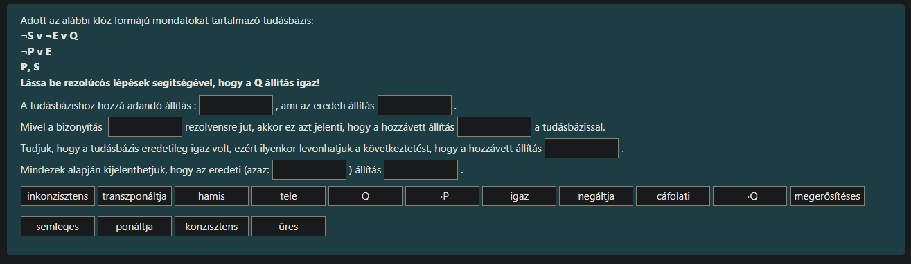
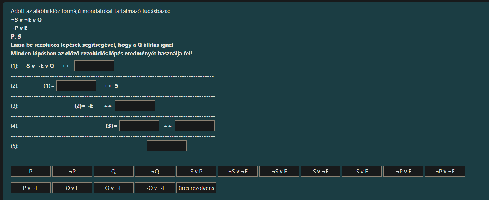

Ez egy klasszikus **indirekt bizonyítás (cáfolati bizonyítás)** rezolúcióval. A lényege: feltesszük az ellenkezőjét annak, amit be akarunk bizonyítani, és ha ez ellentmondásra (üres halmazra) vezet, akkor az eredeti állítás volt az igaz.

Íme a helyes kitöltés sorrendben:

**A tudásbázishoz hozzá adandó állítás:** **`¬Q`**, **ami az eredeti állítás** **`negáltja`**.
*(Magyarázat: Mivel Q-t akarjuk bizonyítani, az ellenkezőjéből, azaz Nem Q-ból indulunk ki.)*

**Mivel a bizonyítás** **`üres`** **rezolvensre jut, akkor ez azt jelenti, hogy a hozzávett állítás** **`inkonzisztens`** **a tudásbázissal.**
*(Magyarázat: Az "üres" rezolvens jelenti a logikai ellentmondást. Az inkonzisztens azt jelenti, hogy a feltételezésünk és a tudásbázis egyszerre nem lehet igaz, "ütik egymást".)*

**Tudjuk, hogy a tudásbázis eredetileg igaz volt, ezért ilyenkor levonhatjuk a következtetést, hogy a hozzávett állítás** **`hamis`**.
*(Magyarázat: Ha ketten veszekednek [inkonzisztencia], és tudjuk, hogy a Tudásbázisnak igaza van, akkor a másik [a hozzávett ¬Q] csak hazudhat.)*

**Mindezek alapján kijelenthetjük, hogy az eredeti (azaz:** **`Q`** **) állítás** **`igaz`**.
*(Magyarázat: Ha a ¬Q hamisnak bizonyult, akkor az ellentettje, a Q muszáj, hogy igaz legyen.)*

---

### Összefoglalva a szavakat, amiket be kell húznod:

1.  **¬Q**
2.  **negáltja**
3.  **üres**
4.  **inkonzisztens**
5.  **hamis**
6.  **Q**
7.  **igaz**

Szuper, ez az előző elméleti kérdés gyakorlati megvalósítása! Itt konkrétan le kell vezetnünk a rezolúciós bizonyítást lépésről lépésre.

Mivel ez egy **indirekt bizonyítás**, az első lépés mindig az, hogy feltételezzük a bizonyítandó állítás ($Q$) ellenkezőjét ($\neg Q$), és ezt adjuk hozzá a rendszerhez.

Itt vannak a helyes válaszok sorban, fentről lefelé:

---

**(1):** $\neg S \lor \neg E \lor Q$ ++ **`¬Q`**
*   *(Magyarázat: Hozzáadjuk a cáfolni kívánt állítást, a $\neg Q$-t. A $Q$ és a $\neg Q$ kiütik egymást, marad a $\neg S \lor \neg E$.)*

**(2):** (1)= **`¬S v ¬E`** ++ $S$
*   *(Magyarázat: Az előző lépés eredményét ($\neg S \lor \neg E$) összeeresztjük az $S$-sel. A $\neg S$ és az $S$ kiütik egymást, marad a $\neg E$.)*

**(3):** (2)= $\neg E$ ++ **`¬P v E`**
*   *(Magyarázat: A $\neg E$-t el kell tüntetnünk. Ehhez keresünk egy olyan szabályt a listából, amiben sima $E$ van. Ez a $\neg P \lor E$. Az $E$-k kiütik egymást, marad a $\neg P$.)*

**(4):** (3)= **`¬P`** ++ **`P`**
*   *(Magyarázat: Az előző lépés eredménye a $\neg P$ volt (bal oldali doboz). Ezt összeeresztjük a tudásbázisban lévő sima $P$-vel (jobb oldali doboz).)*

**(5):** **`üres rezolvens`**
*   *(Magyarázat: A $\neg P$ és a $P$ kiütötték egymást, nem maradt semmi. Ez az ellentmondás, amire vártunk. Bizonyítva!)*

---

### Összefoglalva a dobozok tartalma:

1.  sor: **¬Q**
2.  sor: **¬S v ¬E**
3.  sor: **¬P v E**
4.  sor: **¬P** és **P**
5.  sor: **üres rezolvens**