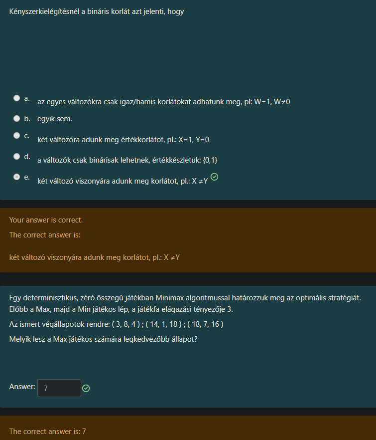
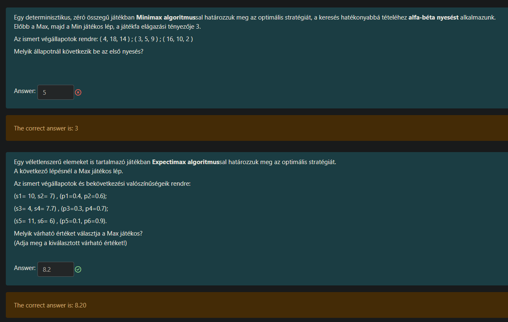

Szuper kérdések! Két teljesen eltérő, de nagyon fontos témakört érintenek: a **Kényszerkielégítést (CSP)** és a **Játékelméletet (Minimax)**.

Nézzük őket sorban, hogy tisztán lásd a logikát!

---

### 1. Kérdés: Bináris korlát (CSP)

**A kérdés:** *Kényszerkielégítésnél a bináris korlát azt jelenti, hogy...*
**A helyes válasz:** **e. két változó viszonyára adunk meg korlátot, pl.: $X \neq Y$**

#### Magyarázat:
A "bináris" szó itt nem a számítástechnikában megszokott "0 vagy 1" jelentéssel bír, hanem a latin *bi-* (kettő) előtagból ered. A kényszereket aszerint csoportosítjuk, hogy **hány változó** vesz részt bennük:

1.  **Unáris (Egyváltozós) korlát:** Csak egyetlen változóra vonatkozik.
    *   *Példa:* $X > 5$ (Az X legyen nagyobb, mint 5). Nem függ senki mástól.
2.  **Bináris (Kétváltozós) korlát:** Két változó kapcsolatát írja le. Ez a leggyakoribb a gráfos feladatoknál (pl. térképszínezés).
    *   *Példa:* $X \neq Y$ (X nem lehet egyenlő Y-nal), vagy $X > Y$.
    *   Ezért helyes az **e** válasz.
3.  **Globális (Többváltozós) korlát:** Három vagy több változót köt össze.
    *   *Példa:* $X + Y + Z = 10$.

**Miért rosszak a többiek?**
*   **a.** és **d.** összekeverik a *korlát típusát* a *változó értékkészletével* (hogy 0 vagy 1 lehet-e). Attól, hogy egy korlát bináris, a változó még felvehet bármilyen értéket (akár színeket, számokat 1-től 100-ig, stb.).
*   **c.** Ez ($X=1, Y=0$) nem korlát, hanem egy konkrét **értékadás** (megoldás). A korlát a *szabály*, az értékadás a *cselekvés*.

---

### 2. Kérdés: Minimax algoritmus számolása

Ez a feladat egy klasszikus **Minimax fa** kiértékelése. Ez az alapja a sakknak, a tic-tac-toe-nak és minden kétszemélyes játéknak.

**A feladat adatai:**
*   **Szereplők:** MAX (aki a legnagyobb számot akarja) és MIN (aki a legkisebbet).
*   **Sorrend:** A gyökérben (legfelül) a **MAX** áll. Alatta a **MIN** játékosok vannak.
*   **Elágazás:** 3 (mindenkinek 3 választása van).
*   **Végállapotok (levelek):** Három csoportban vannak megadva, balról jobbra.

#### A számolás menete (Lentről felfelé)

Képzelj el egy fát.
1.  Legalul vannak a számok (a levelek).
2.  Felettük van a **MIN** szintje (mert "Előbb a Max, majd a Min lép", tehát a Min lépése után jönnek az eredmények).
3.  Legfelül van a **MAX** (a gyökér).

**1. Lépés: A MIN döntései (Lentről kezdünk)**
A MIN játékos mindig a lehető **legkisebb** számot választja a rendelkezésre állókból, mert ő a "rosszfiú", le akarja törni a pontszámot.

*   **Bal oldali ág:** A számok: $(3, 8, 4)$.
    *   A MIN választása: **3** (ez a legkisebb).
*   **Középső ág:** A számok: $(14, 1, 18)$.
    *   A MIN választása: **1** (ez a legkisebb).
*   **Jobb oldali ág:** A számok: $(18, 7, 16)$.
    *   A MIN választása: **7** (ez a legkisebb).

Most ott tartunk, hogy a MIN "feladta" ezeket a számokat a főnöknek (MAX-nak). A MAX előtt most ez a három lehetőség hever: **3, 1, 7**.

**2. Lépés: A MAX döntése (A gyökérben)**
A MAX játékos – nevéből adódóan – a lehető **legnagyobb** nyereségre hajt.

*   Lehetőségek: $\{3, 1, 7\}$.
*   A MAX választása: **7** (mert $7 > 3$ és $7 > 1$).

**Tehát a helyes válasz: 7.**

---

### Összefoglalva a vizsgára:
*   **Bináris korlát:** Két szereplő (változó) közötti szabály (pl. szomszédok).
*   **Minimax:** Mindig lentről felfelé haladj.
    *   A csoportokból (zárójelekből) először válaszd ki a legkisebbet (ez a MIN munkája).
    *   A kapott számok közül a végén válaszd ki a legnagyobbat (ez a MAX munkája).
	
	
	

	
	Semmi gond, pont ezek a trükkös részek! Az első feladatnál (Alfa-béta vágás) nagyon könnyű elcsúszni, ha nem követjük szigorúan az algoritmus gondolatmenetét. A másodiknál (Expectimax) pedig tökéletesen számoltál, ott csak megerősítem a logikát.

Nézzük őket részletesen!

---

### 1. Kérdés: Alfa-béta nyesés (Alpha-Beta Pruning)

**A kérdés:** *Melyik állapotnál következik be az első nyesés?*
**A te válaszod:** 5 (Hibás)
**A helyes válasz:** **3**

#### Miért 3? (A nyomozás lépései)

Képzeljük el a szituációt: Te vagy a **MAX** játékos (a fa tetején). A te célod, hogy minél nagyobb számot szerezz. Alattad van három **MIN** játékos (három ág), ők a lehető legkisebb számot akarják feladni neked.

**1. Bal oldali ág vizsgálata:**
*   A MIN játékos megnézi a számait: $(4, 18, 14)$.
*   Mivel ő MIN, a legkisebbet választja: a **4**-est.
*   Felküldi neked: "Főnök, innen a legjobbat hoztam, ami a 4-es."
*   **A te helyzeted (MAX):** Van a kezedben egy **4-es**. Ez a te "biztos pontod" (ezt hívjuk Alfának: $\alpha = 4$). Innentől kezdve **bármi, ami 4-nél rosszabb (kisebb), téged nem érdekel.**

**2. Középső ág vizsgálata (Itt történik a varázslat!):**
*   A középső MIN játékos elkezdi megnézni a saját számait: $(3, 5, 9)$.
*   **Első lépés:** Megnézi az első számot, ami a **3**.
*   Ekkor a MIN játékos azt mondja: "Hahó, találtam egy 3-ast! Mivel én a legkisebbet keresem, az én eredményem innentől kezdve biztosan 3 lesz, vagy még annál is kisebb."
*   **Te (MAX) közbeszólsz:** "Állj! Nekem a bal ágról már van egy **4**-esem. Te most mutattál egy **3**-ast. Mivel te a MIN vagy, te ezt a 3-ast (vagy még rosszabbat) fogod választani. De a 3-as **rosszabb**, mint a 4-esem. Ezért az egész ágad kuka! Nem érdekel a többi számod (az 5 és a 9)."

**Mi történt itt?**
A nyesés **azonnal** megtörtént, amint a MIN meglátta a **3**-ast.
Nem nézte meg az 5-öt. Nem nézte meg a 9-et.
Azért a **3** a helyes válasz, mert **ennél az értéknél jött rá az algoritmus**, hogy felesleges tovább keresni.

**Miért volt hibás az 5?**
Valószínűleg azt hitted, hogy megnézi a 3-at, aztán az 5-öt, és összehasonlítja őket. De az alfa-béta vágás "türelmetlen". Ha a bal zsebedben van 4000 Ft, és a jobb zsebedből húzol egy 3000-est, nem kutatsz tovább a jobb zsebedben apróért, mert már tudod, hogy a bal zseb nyert.

---

### 2. Kérdés: Expectimax (Várható érték)

**A kérdés:** *Melyik várható értéket választja a Max játékos?*
**A te válaszod:** **8.2** (Helyes!)

#### Hogyan jön ez ki? (A logika megerősítése)

Itt nem ellenfél van (MIN), hanem a véletlen (CHANCE/DICE). Nem a legrosszabbat választjuk, hanem **súlyozott átlagot** (várható értéket) számolunk.
Képlet: $\text{Érték} \cdot \text{Valószínűség}$.

Számoljuk ki a három ágat:

1.  **Első ág:**
    *   Értékek: 10 és 7
    *   Valószínűségek: 0.4 és 0.6
    *   Számítás: $(10 \cdot 0,4) + (7 \cdot 0,6) = 4 + 4,2 = \mathbf{8,2}$

2.  **Második ág:**
    *   Értékek: 4 és 7.7
    *   Valószínűségek: 0.3 és 0.7
    *   Számítás: $(4 \cdot 0,3) + (7,7 \cdot 0,7) = 1,2 + 5,39 = \mathbf{6,59}$

3.  **Harmadik ág:**
    *   Értékek: 11 és 6
    *   Valószínűségek: 0.1 és 0.9
    *   Számítás: $(11 \cdot 0,1) + (6 \cdot 0,9) = 1,1 + 5,4 = \mathbf{6,5}$

**A döntés:**
A MAX játékos áll legfelül. Előtte hevernek a várható értékek: $8,2$, $6,59$ és $6,5$.
Mivel ő MAX, a legnagyobbat választja.
Tehát a helyes válasz: **8.2** (vagy 8.20).

Jól számoltál, csak így tovább! Az alfa-bétánál pedig mindig azt figyeld: **"Láttam-e már olyat, ami rosszabb, mint a biztos jóm?"** Ha igen -> VÁGÁS azonnal.