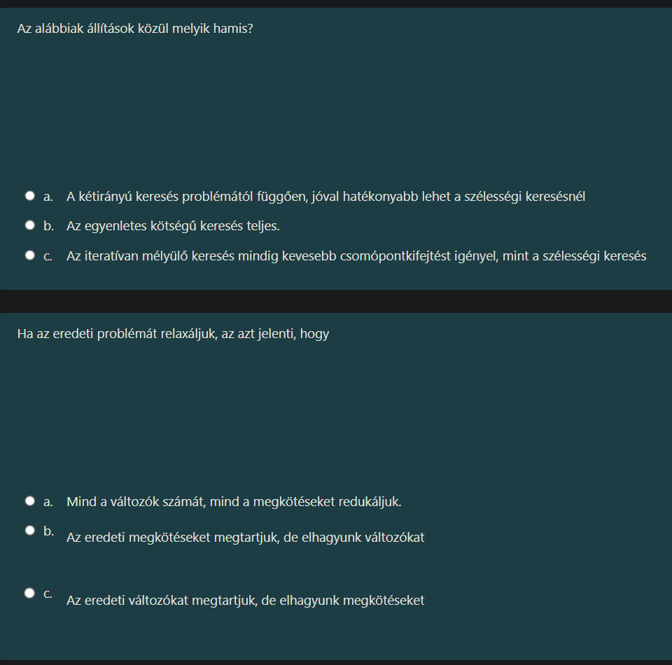

Szuper, vágjunk is bele! Ez a két kérdés a **Keresési problémák** témakörét fedi le.

Az első kérdés a „Vakon keresés” (információ nélküli keresés) stratégiáinak összehasonlításáról szól, a második pedig az „Informált keresés” (heurisztikus keresés) egyik alapkövéről, a heurisztika-készítésről.

Nézzük őket sorban, részletesen kibontva.

---

### 1. Kérdés: Keresési algoritmusok összehasonlítása

**A kérdés:** *Az alábbiak állítások közül melyik hamis?*

**A helyes válasz (tehát a HAMIS állítás):**
**c. Az iteratívan mélyülő keresés mindig kevesebb csomópontkifejtést igényel, mint a szélességi keresés**

#### Miért ez a hamis? (A részletes magyarázat)

Helyezzük el a térképen: Itt két alapvető algoritmust hasonlítunk össze.
1.  **Szélességi keresés (BFS - Breadth-First Search):** Szintről szintre halad. Először megnézi az összes 1 lépésre lévő állapotot, aztán a 2 lépésre lévőket, és így tovább.
2.  **Iteratívan mélyülő keresés (IDS - Iterative Deepening Search):** Ez egy trükkös módszer. Azt csinálja, hogy lefuttat egy mélységi keresést (DFS) 1-es korláttal, aztán *újrakezdi* elölről 2-es korláttal, aztán *megint újrakezdi* 3-as korláttal...

**A matek mögötte:**
Az IDS legnagyobb hátránya, hogy **pazarolnak tűnik**. Mivel minden mélységnövelésnél *újrakezdi* a keresést a start állapotból, a felső szintek csomópontjait többször is kifejti (generálja).

*   A **BFS** minden csomópontot (ideális esetben) egyszer fejt ki.
*   Az **IDS** a legfelső szintet $d$-szer fejti ki, a másodikat $(d-1)$-szer... és a legalsót 1-szer.

Bár az aszimptotikus bonyolultságuk azonos ($O(b^d)$), konstans szorzóban az IDS **több** munkát végez (több csomópontot generál), mint a BFS, hiszen folyton újragenerálja a felső részeket.

**Akkor miért használjuk mégis az IDS-t?**
Nem a sebesség miatt, hanem a **memória** miatt!
*   A **BFS** memóriája exponenciális (be kell táraznia az egész legalsó szintet). Ez a gyakorlatban hamar elfogyasztja a RAM-ot.
*   Az **IDS** memóriája lineáris (csak egy ágat tárol).

**Tehát az állítás azért hamis**, mert azt mondja, "mindig kevesebb csomópontkifejtést igényel", holott a valóságban kicsivel **többet** igényel az ismétlések miatt.

---

#### Miért IGAZ a többi állítás? (Hogy lásd az összefüggést)

*   **a. A kétirányú keresés (bidirectional search) problémától függően, jóval hatékonyabb lehet a szélességi keresésnél.**
    *   *Mi ez?* Ahelyett, hogy csak a Startból indulnál a Cél felé, egyszerre indulsz a Startból és a Célból is, és középen találkoznak.
    *   *Matek:* Ha a megoldás $d$ mélységben van és az elágazási tényező $b$.
        *   Szélességi keresés (BFS): $b^d$ lépés. (Ez irdatlan sok lehet).
        *   Kétirányú keresés: Két darab $b^{d/2}$ sugarú kört keresel. $2 \cdot b^{d/2}$.
    *   *Példa:* Ha $b=10$ és $d=6$.
        *   BFS: $10^6 = 1.000.000$ csomópont.
        *   Kétirányú: $2 \cdot 10^3 = 2.000$ csomópont.
    *   Ez **hatalmas** különbség, tehát az állítás **IGAZ**.

*   **b. Az egyenletes költségű keresés (Uniform Cost Search - UCS) teljes.**
    *   *Mi ez?* Ez a Dijkstra algoritmus "butább" tesója (heurisztika nélkül). Mindig a legolcsóbb úton lévő csomópontot fejti ki következőnek.
    *   *Mit jelent a "teljes"?* Azt, hogy ha létezik megoldás, az algoritmus garantáltan megtalálja-e.
    *   *Magyarázat:* Az UCS teljes, **feltéve**, hogy minden lépés költsége egy pozitív minimális érték felett van ($\epsilon > 0$). Ha lennének 0 vagy negatív költségű élek (és körök), akkor végtelen ciklusba kerülhetne. De a standard definíció szerint (pozitív költségekkel) **IGAZ**, hogy teljes.

---

### 2. Kérdés: Heurisztikák és Relaxáció

**A kérdés:** *Ha az eredeti problémát relaxáljuk, az azt jelenti, hogy...*

**A helyes válasz:**
**c. Az eredeti változókat megtartjuk, de elhagyunk megkötéseket**

#### Mi ez az anyag? (Kontextus)
Most az **A* (A-csillag)** keresésnél és a heurisztikáknál járunk. Ahhoz, hogy az A* algoritmus jól működjön és garantáltan optimális (legrövidebb) utat találjon, **admisszibilis** (elfogadható) heurisztikára van szükség.

Az admisszibilis heurisztika azt jelenti, hogy a becslésünk sosem lehet nagyobb, mint a valós hátralévő út. De honnan szüljünk ilyen becslést? Erre való a **relaxáció**.

#### Részletes magyarázat

A "relaxáció" szó itt nem pihenést jelent, hanem **lazítást**. A probléma szigorú szabályait (megkötéseit) lazítjuk fel, hogy könnyebb legyen megoldani.

**Példa: A 8-as kirakó (Tili-toli játék)**
*   *Eredeti probléma:* Egy számot csak akkor tolhatsz arrébb, ha (1) mellette van az üres hely (szomszédossági megkötés) ÉS (2) az a hely üres (üres hely megkötés). Ez nehéz.
*   *Relaxált probléma (1. szint):* Tegyük fel, hogy a kockák "repülni" tudnak. Elhagyjuk azt a megkötést, hogy csak a szomszédba lehet lépni, és azt is, hogy üresnek kell lennie. Bárhova teheted a kockát.
    *   Ennek a "könnyített" játéknak a megoldása: Annyi lépés, ahány kocka rossz helyen van. (Ez a Hamming-távolság heurisztika).
*   *Relaxált probléma (2. szint):* Tegyük fel, hogy a kockák át tudnak menni egymáson, de csak szomszédba léphetnek (elhagyjuk az "üres hely" megkötést).
    *   Ennek a megoldása: Minden kockának ki kell számolni, hány lépés lenne eljutni a helyére, ha üres lenne a pálya. (Ez a Manhattan-távolság).

**Összefüggés:**
A relaxált probléma megoldása mindig **kisebb vagy egyenlő** (költségben), mint az eredeti probléma megoldása, hiszen kevesebb az akadály. Ezért tökéletes **admisszibilis heurisztikának**.

#### Miért nem a többi?
*   **a. Mind a változók számát, mind a megkötéseket redukáljuk.** -> Ha a változók számát (pl. a 8-as kirakóban a kockák számát) csökkentjük, az nem relaxáció, hanem **absztrakció** (egyszerűsítés). Ez is egy módszer, de mást jelent.
*   **b. Az eredeti megkötéseket megtartjuk, de elhagyunk változókat.** -> Ez szintén absztrakció lenne. A relaxáció lényege a szabályok (megkötések) törlése, hogy a mozgástér *nőjön*.

---

### Összefoglalva a vizsgára:

1.  **IDS (Iteratív mélységi):** Nem a leggyorsabb (kicsit lassabb a BFS-nél a sok újragenerálás miatt), de nagyon **memóriatakarékos**. Azért használjuk, mert a BFS megeszi a memóriát.
2.  **Relaxáció:** Egy trükk, amivel **heurisztikát gyártunk**. Azt jelenti: "Mi lenne a legrövidebb út, ha átmehetnék a falakon?". A falak a "megkötések". Ha elhagyod a megkötést (a falat), megkapod a relaxált problémát.

Remek, haladjunk tovább! Most az **Informált keresési stratégiák** (más néven Heurisztikus keresések) sűrűjében vagyunk.

Itt már nem "vakon" tapogatózunk (mint a szélességi keresésnél), hanem van valami sejtésünk (heurisztikánk) arról, hogy merre van a cél.

Nézzük a kérdéseket részletesen!

---

### 1. Kérdés: A mohó keresés (Greedy Search)

**A kérdés:** *A mohó keresésre melyik állítás igaz?*

**A helyes válasz:**
**d. A mohó keresés egy legjobbat először (Best-first) típusú keresés, ahol azt a csomópontot fejti ki először, amit a heurisztika alapján a legközelebbinek ítél a célállapothoz.**

#### Miért ez a helyes? (A részletes magyarázat)

**Mi az a "Best-first" (Legjobbat először) keresés?**
Ez egy gyűjtőfogalom. Azt jelenti, hogy van egy értékelő függvényünk, jelöljük $f(n)$-nek. Mindig azt a csomópontot választjuk a következő lépéshez, ahol ez az $f(n)$ érték a legkisebb (a "legjobb").

A különbség az algoritmusok között abban van, hogy miből áll ez az $f(n)$:
1.  **Uniform Cost Search (Egyenletes költségű):** Csak a múltat nézi. $f(n) = g(n)$ (eddig megtett út költsége).
2.  **Mohó keresés (Greedy):** Csak a jövőt nézi (tippel). $f(n) = h(n)$ (becsült távolság a célig).
3.  **A* keresés:** A kettő összege. $f(n) = g(n) + h(n)$.

**Elemzzük a válaszlehetőségeket:**

*   **a. és b. (Teljesség és Optimalitás):**
    *   A mohó keresés **NEM Optimális:** Mivel csak a célt figyeli ("Ott a hegycsúcs, menjünk arra!"), simán bevihet egy zsákutcába vagy egy nagyon drága kerülőútra, csak azért, mert az elején jónak tűnt az irány.
    *   A mohó keresés **NEM Teljes:** Ha nincsenek körök a gráfban, akkor megtalálja a megoldást. De ha vannak körök (pl. két város között ingázik, mert mindkettő közel van a célhoz), akkor végtelen ciklusba kerülhet.
    *   *Ezért az 'a' és 'b' állítások technikailag nem állják meg a helyüket általánosságban.*

*   **c. ...amit az eddig megtett út költsége alapján...**
    *   Ez a definíció az **Egyenletes költségű keresésre (UCS)** illik, nem a mohóra. A mohót nem érdekli, mennyit gyalogoltál eddig, csak az, hogy milyen messze látja a célt.

*   **d. ...amit a heurisztika alapján a legközelebbinek ítél...**
    *   **EZ A NYERŐ.** Ez a Mohó keresés pontos definíciója. A $h(n)$ heurisztika mondja meg, milyen "közel" érezzük magunkat a célhoz, és a mohó algoritmus mindig a legkisebb $h(n)$-t választja.

**Példa a való életből:**
El akarsz jutni Budapestről Debrecenbe.
*   *Mohó keresés:* Látod a táblát, hogy "Debrecen egyenesen". Elindulsz arra, mert az tűnik a legrövidebbnek légvonalban. Nem érdekli, hogy esetleg dugó van, vagy nincs autópálya.
*   *UCS:* Azt az utat választja, ahol a legkevesebb benzint égettél el eddig, függetlenül attól, hogy közeledsz-e Debrecenhez.

---

### 2. Kérdés: Elfogadható (Admisszibilis) heurisztika

**A kérdés:** *Egy heurisztika elfogadható, ha...*

**A helyes válasz:**
**b. a h függvény soha nem becsüli felül a cél eléréséhez szükséges költséget.**

*(Látom a képen ezt jelölted be, ez tökéletes!)*

#### Miért ez a helyes? (Az elméleti háttér)

Ez az **A* (A-csillag) keresés** legfontosabb fogalma. Az A* csak akkor garantálja, hogy megtalálja a **legrövidebb (optimális)** utat, ha a heurisztika ($h$) **elfogadható (admisszibilis)**.

**Definíció:**
Legyen $h^*(n)$ a *tényleges, valós* költség a célig (amit ugye nem tudunk előre, csak Isten vagy egy jós tudna).
A mi $h(n)$ becslésünk akkor elfogadható, ha minden $n$ csomópontra:
$$0 \le h(n) \le h^*(n)$$

Magyarul: **A becslésünknek mindig OPTIMISTÁNAK kell lennie.** Azt kell hinnie, hogy a cél közelebb van (vagy pont ott van), mint a valóságban. Soha nem mondhatja azt, hogy "Á, ez még legalább 100 km", ha a valóságban csak 80 km.

**Miért baj a túlbecslés (felülbecslés)?**
Képzeld el, hogy két út van:
1.  Egy rövid út (valós hossza: 10), de a heurisztikád "pesszimista" és azt hazudja rá, hogy 50.
2.  Egy hosszú út (valós hossza: 30), a heurisztikád pontos (30).

Az algoritmus ránéz a számokra. Azt hiszi, az első út 50 hosszú, a második 30. Ezért elindul a másodikon. Ezzel **elhagyta az optimális megoldást** a rossz (túlbecslő) heurisztika miatt. Ezért tilos felülbecsülni!

**Elemzzük a többi választ:**

*   **a. és d. (Eddig megtett út):** A heurisztika ($h$) mindig a *jövőre* vonatkozik (mennyi van még hátra?). Az eddig megtett út ($g$) a múlt. Ezek a válaszok fogalmilag keverik a $g$-t és a $h$-t.
*   **c. ...soha nem becsüli alul...**: Ez azt jelentené, hogy pesszimista (többet mond a valósnál). Ahogy fent írtam, ez a "bűn", ami miatt elveszítjük az optimalitást.

**Példa a vizsgára:**
Térképen a **légvonalbeli távolság** mindig elfogadható heurisztika. Miért? Mert a valóságban az utak kanyarognak. A légvonalnál (egyenesnél) rövidebb út fizikailag nem létezik. Tehát a légvonal sosem fogja *túlbecsülni* a valós távolságot, legfeljebb egyenlő lesz vele (ha az út nyílegyenes).

### Összefüggés a két kérdés között:

A **Mohó keresés** (1. kérdés) nem foglalkozik azzal, hogy a heurisztika elfogadható-e, csak rohan a cél felé. Ezért nem is optimális.
Az **A* keresés** viszont pont attól lesz zseniális és optimális, hogy **elfogadható heurisztikát** (2. kérdés) használ, és hozzáadja a múltbeli költséget ($g+h$).