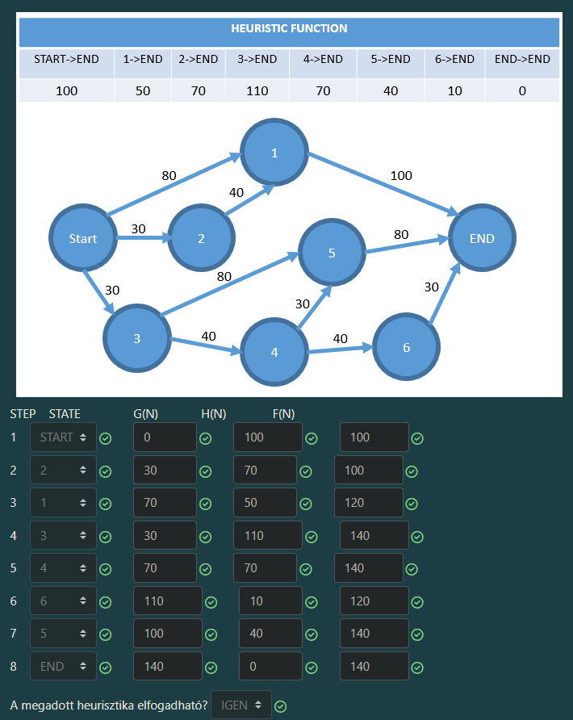
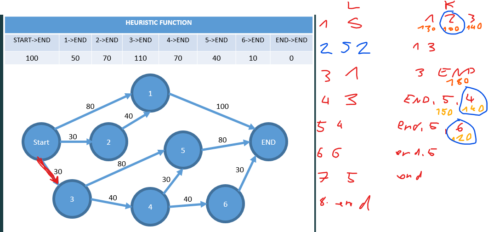

Értem! Akkor felejtsük el a konkrét számokat, és nézzük meg a **"receptet"**. Ezt a logikát bármilyen A* feladatra ráhúzhatod, teljesen mindegy, milyenek a számok vagy a gráf.

Itt van az **általános útmutató**, lépésről lépésre, ahogy egy vizsgán gondolkodnod kell:

---

### 1. A Képletek (Mit írsz az oszlopokba?)

Amikor egy sort ki kell töltened, mindig ezt a három értéket kell kiszámolnod az éppen kiválasztott csomópontra (nevezzük **Aktuálisnak**):

*   **G(N) = A MÚLT (Tényleges költség)**
    *   **Jelentése:** Mennyibe került eljutni a Startból ide?
    *   **Így számold:** Nézd meg az **Előző** csomópont (ahonnan ide léptél) G értékét, és add hozzá a **nyílon lévő számot** (útiköltség).
    *   *Képlet:* $G(\text{Aktuális}) = G(\text{Előző}) + \text{Nyíl\_költsége}$

*   **H(N) = A JÖVŐ (Becslés)**
    *   **Jelentése:** Szerintünk milyen messze van még a cél?
    *   **Így számold:** Nem kell számolni. **Puskázol.** Megkeresed a feladatban lévő heurisztika táblázatot, és kimásolod a számot, ami az Aktuális csomóponthoz tartozik.

*   **F(N) = A DÖNTÉS (Összesített érték)**
    *   **Jelentése:** Mennyire tűnik jónak ez az útvonal összesen?
    *   **Így számold:** Egyszerű összeadás.
    *   *Képlet:* $F = G + H$

---

### 2. A "Játék" Menete (Az algoritmus lépései)

Képzeld el, hogy van egy listád azokról a csomópontokról, amiket már látsz, de még nem léptél rájuk (ezt hívják *Open List*-nek).

**1. Lépés: A VÁLASZTÁS**
*   Ránézel a listádra.
*   Keresed azt a csomópontot, akinek a **legkisebb az F értéke**.
*   Ha döntetlen van (két egyforma F), általában a betűrendben előrébb lévőt, vagy a célt választjuk (ha köztük van).
*   Ezt a nyertest írod be a táblázat következő sorába a **STATE** helyre.

**2. Lépés: A KIFEJTÉS (Szomszédok vizsgálata)**
*   Most, hogy kiválasztottad a nyertest, megnézed, hova vezetnek belőle nyilak (kik a **szomszédai**).
*   Minden szomszédra kiszámolod a számokat (G, H, F):
    *   A **G**-t úgy, hogy a mostani helyed G-jéhez hozzáadod az utat.
    *   A **H**-t kinézed a táblázatból.
    *   Az **F**-et összeadod.

**3. Lépés: A FRISSÍTÉS (A legfontosabb trükk!)**
Itt rontják el a legtöbben. Két eset van egy szomszédnál:
*   **A) Még sosem láttad ezt a szomszédot:** Szuper, felírod a listádra az új G, H, F értékeivel.
*   **B) Már láttad ezt a szomszédot (már rajta van a listán):**
    *   Megnézed: Az **új útvonal**, amin most találtad meg, **olcsóbb (kisebb G)**, mint a régi?
    *   **HA IGEN (Rövidebb utat találtál!):** Kidobod a régi adatokat, és beírod az újat (az új, kisebb G-vel és F-fel). A szülőjét is átírod a mostanira.
    *   **HA NEM (A régi út jobb volt vagy ugyanaz):** Az új utat elfelejted, nem csinálsz semmit.

**4. Lépés: ISMÉTLÉS**
*   Visszaugrasz az 1. lépésre: megint megnézed a listát, megint a legkisebb F-et választod... egészen addig, amíg a **Cél (END)** csomópontot ki nem választod.

---

### Összefoglaló puska (Checklist):

Amikor ülsz a feladat felett, ezt kérdezd magadtól:

1.  **Kire lépek most?** -> Akinek a legkisebb az F-je a várakozók közül.
2.  **Mennyi a G-je?** -> (Apukája G-je) + (Út költsége).
    *   *Kivétel: Ha Start, akkor 0.*
    *   *Kivétel: Ha találtál egy rövidebb utat hozzá, akkor az új, kisebb érték.*
3.  **Mennyi a H-ja?** -> Táblázatból kinéz.
4.  **Mennyi az F-je?** -> G + H.

Ennyi az egész titka! Nincs benne bonyolult matek, csak összeadás és összehasonlítás (kisebb/nagyobb).