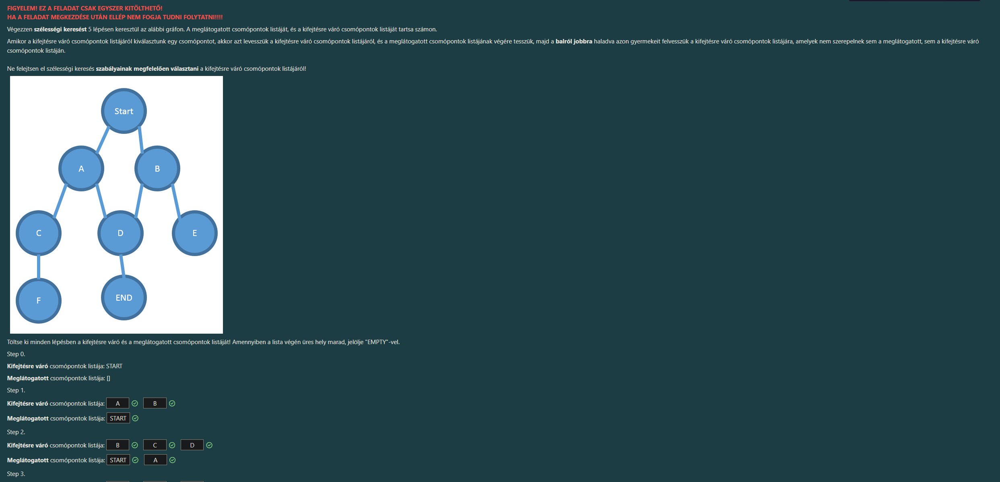

Rendben, csináljuk végig lépésről lépésre! Ez egy klasszikus **Szélességi Keresés (BFS - Breadth-First Search)** feladat.

**A logika, amit követnünk kell:**
A szélességi keresés olyan, mint egy sorban állás a postán (FIFO - First In, First Out).
1.  Mindig a sor (**Kifejtésre váró**) **legelejéről** vesszük ki a csomópontot.
2.  Átrakjuk a **Meglátogatott** listára.
3.  A gyerekeit (akiket még nem láttunk) a sor **legvégére** illesztjük be (balról jobbra sorrendben).

A képen a 2. lépésig látszik a megoldás, innen folytatjuk.
*   **A 2. lépés végén az állás:**
    *   Sorban állnak: `B, C, D`
    *   Már voltak: `START, A`
*   A következőnek a sor elejéről a **B**-t kell kivennünk.

Íme a pontos megoldás a 3., 4. és 5. lépéshez:

---

### Step 3. (A `B` csomópont kifejtése)
A sor elején a **B** állt. Ezt kivesszük, és a gyerekeit (a képen a **B** alatt csak az **E** van) betesszük a sor legvégére.

*   **Kifejtésre váró csomópontok listája:** `C`, `D`, `E`
    *(Magyarázat: A `B` kiment, a `C` és `D` előrébb csúszott, az `E` beállt a végére.)*
*   **Meglátogatott csomópontok listája:** `START`, `A`, `B`

---

### Step 4. (A `C` csomópont kifejtése)
Most a sor elején a **C** áll. Ezt kivesszük, és a gyerekeit (a képen a **C** alatt az **F** van) betesszük a sor legvégére.

*   **Kifejtésre váró csomópontok listája:** `D`, `E`, `F`
    *(Magyarázat: A `C` kiment, a `D` és `E` előrébb csúszott, az `F` beállt a végére.)*
*   **Meglátogatott csomópontok listája:** `START`, `A`, `B`, `C`

---

### Step 5. (A `D` csomópont kifejtése)
Most a sor elején a **D** áll. Ezt kivesszük, és a gyerekeit (a képen a **D** alatt az **END** van) betesszük a sor legvégére.

*   **Kifejtésre váró csomópontok listája:** `E`, `F`, `END`
    *(Magyarázat: A `D` kiment, az `E` és `F` előrébb csúszott, az `END` beállt a végére.)*
*   **Meglátogatott csomópontok listája:** `START`, `A`, `B`, `C`, `D`

---

**Fontos tipp a kitöltéshez:**
Ha a felületen több doboz van, mint ahány betű (pl. 4 doboz van, de csak 3 betűnk: C, D, E), akkor a maradék üres helyekre írd be, hogy **EMPTY** (vagy hagyd üresen, ha a rendszer engedi, de a feladat szövege kéri az EMPTY jelölést üres hely esetén).

**Összefoglalva, mit írj be:**

**Step 3:**
Kifejtésre váró: **C, D, E**
Meglátogatott: **START, A, B**

**Step 4:**
Kifejtésre váró: **D, E, F**
Meglátogatott: **START, A, B, C**

**Step 5:**
Kifejtésre váró: **E, F, END**
Meglátogatott: **START, A, B, C, D**